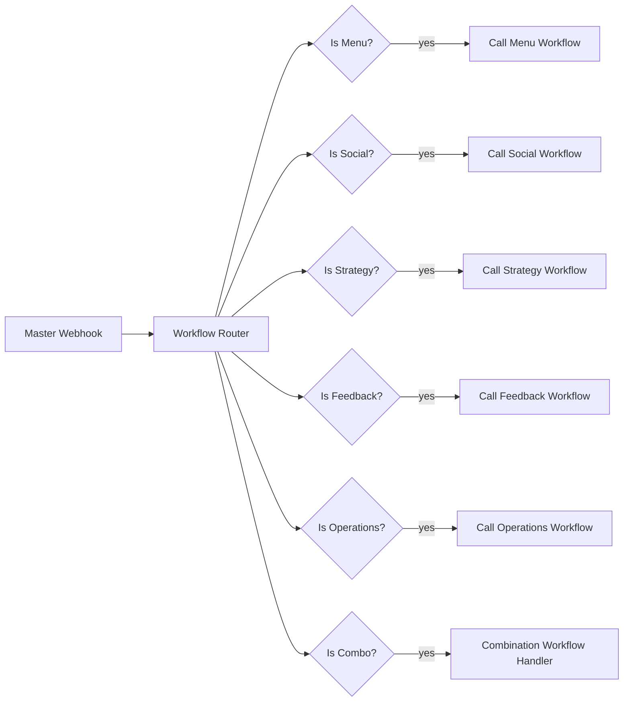

# MitchAI n8n automations

Original workflow exports from the MitchAI operations stack (n8n 1.x), credentials and instance ids stripped by `scripts/strip-credentials.mjs`. Import via n8n → Workflows → Import from file, then attach your own credentials.

| File | Workflow | Nodes | Role in the CV narrative |
|---|---|---|---|
| master-orchestrator.json | Master Orchestrator | 17 | Webhook → code router → IF nodes → sub-workflow calls (Menu / Social / Strategy / Feedback / Operations / Combo) |
| daily-operations.json | Daily Operations Assistant | 5 | "Ops agent": prompt build → Claude → format |
| menu-innovation.json | Menu Innovation Engine | 5 | "Menu agent" |
| social-media.json | Social Media Content Generator | 5 | "Media agent" |
| customer-feedback.json | Customer Feedback Analyzer | 5 | sentiment + themes |
| business-strategy.json | Business Strategy Advisor | 5 | |
| parallel-ai-consensus.json | Parallel AI Consensus Decision | 8 | fan-out, consensus check, writes decision to Postgres |
| multi-ai-parallel.json | Multi-AI Provider Parallel | 7 | LM Studio (local) + OpenAI + Claude in parallel, aggregated |

## Run locally
1. `docker compose up n8n` (from repo root) → http://localhost:5678
2. Import `multi-ai-parallel.json`; set the LM Studio URL to a running local model and one cloud key.
3. POST `{"prompt":"Suggest three specials for a rainy Tuesday"}` to the webhook URL shown on the Webhook node.

Status: implementation evidence. These workflows ran against the Mitch from Transylvania stall operations in 2025; no production SLA is claimed.
