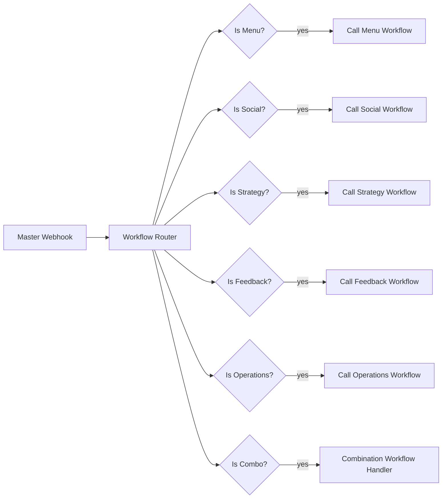

# MitchAI n8n automations

Original workflow exports from the MitchAI operations stack (n8n 1.x), credentials and instance ids stripped by `scripts/strip-credentials.mjs`. Import via n8n → Workflows → Import from file, then attach your own credentials.

| File | Workflow | Nodes | Role in the CV narrative |
|---|---|---|---|
| master-orchestrator.json | Master Orchestrator | 17 | Webhook → code router → IF nodes → sub-workflow calls (Menu / Social / Strategy / Feedback / Operations / Combo) |
| daily-operations.json | Daily Operations Assistant | 5 | "Ops agent": prompt build → Claude → format |
| menu-innovation.json | Menu Innovation Engine | 5 | "Menu agent" |
| social-media.json | Social Media Content Generator | 5 | "Media agent" |
| customer-feedback.json | Customer Feedback Analyzer | 5 | sentiment + themes |
| business-strategy.json | Business Strategy Advisor | 5 | |
| parallel-ai-consensus.json | Parallel AI Consensus Decision | 8 | fan-out, consensus check, writes decision to Postgres |
| multi-ai-parallel.json | Multi-AI Provider Parallel | 7 | LM Studio (local) + OpenAI + Claude in parallel, aggregated |

## Run locally

The root `docker-compose.yml` publishes n8n's internal port 5678 to the
**host port 5679** (`"5679:5678"`). There is no service on 5678 on the
host — always use 5679 from your browser/curl.

1. Set `POSTGRES_PASSWORD`, `N8N_USER`, `N8N_PASSWORD` in a repo-root
   `.env` (see `.env.example`).
2. `docker compose --profile n8n-demo up -d postgres mcp-server n8n`
   (from repo root) → n8n UI at http://localhost:5679, login with
   `N8N_USER` / `N8N_PASSWORD`.
   - `mcp-server` is a zero-dependency fixture server
     (`automations/n8n/mock-mcp/server.js`) that stands in for the
     internal `http://mcp-server:3000` host that six of these workflows
     call (`daily-operations`, `customer-feedback`, `menu-innovation`,
     `business-strategy`, `social-media`, `parallel-ai-consensus`). It
     returns canned, fixture-shaped JSON — not real model output — and
     is only started when you pass `--profile n8n-demo`.
3. In the n8n UI: Workflows → Import from File → pick e.g.
   `daily-operations.json`, then open its Webhook node to get the live
   webhook URL (e.g. `http://localhost:5679/webhook/daily-operations`).
4. POST a JSON body to that URL, e.g.
   `curl -X POST http://localhost:5679/webhook/daily-operations -H 'Content-Type: application/json' -d '{"operation_type":"daily_checklist","shift":"morning"}'`.
   n8n's Webhook node nests your JSON under `body` (confirmed against the
   [n8n Webhook node source](https://github.com/n8n-io/n8n/blob/master/packages/nodes-base/nodes/Webhook/Webhook.node.ts));
   every workflow's first Code node here reads
   `$input.item.json.body ?? $input.item.json` so it accepts both that
   real webhook envelope and a flat payload (e.g. from a manual-trigger
   test run).
5. `multi-ai-parallel.json` does **not** call `mcp-server` — its three
   HTTP/LLM nodes call `http://lm-studio:1234/...` (a local LM Studio
   instance), the OpenAI node (via an n8n credential), and
   `https://api.anthropic.com/v1/messages` directly. Running it
   end-to-end needs your own LM Studio instance and API keys/credentials;
   without them the provider calls fail (a legitimate failure path — see
   `automations/n8n/evidence/`), but its `Parse Request` node still
   correctly extracts `prompt`/`message` from the webhook body.
6. See `automations/n8n/evidence/README.md` for the exact
   import/execute commands used to capture reproducibility evidence for
   `multi-ai-parallel.json` and `daily-operations.json`, including a
   simulated 500 from `mcp-server` and the resulting error-branch output.

Status: sanitised exports for all eight workflows (credentials/instance
ids stripped by `scripts/strip-credentials.mjs`), plus **executed with
fixtures on 2026-09-11** for `multi-ai-parallel.json` and
`daily-operations.json` (see `automations/n8n/evidence/`). The other six
files are sanitised-export evidence only — they have not been
independently executed as part of this pass. These workflows ran against
the Mitch from Transylvania stall operations in 2025; no production SLA
is claimed.
